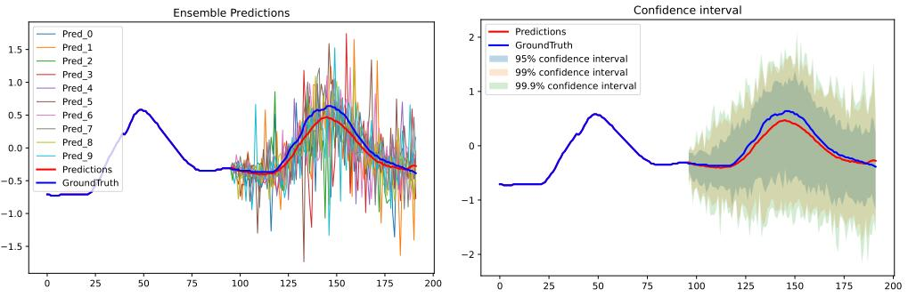
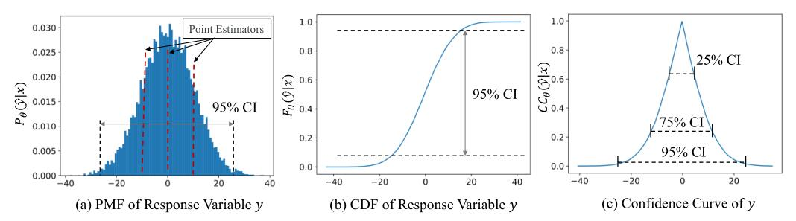
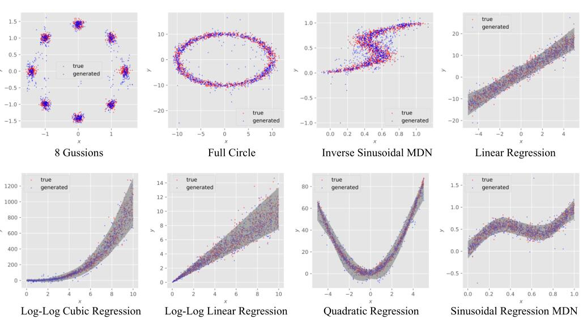
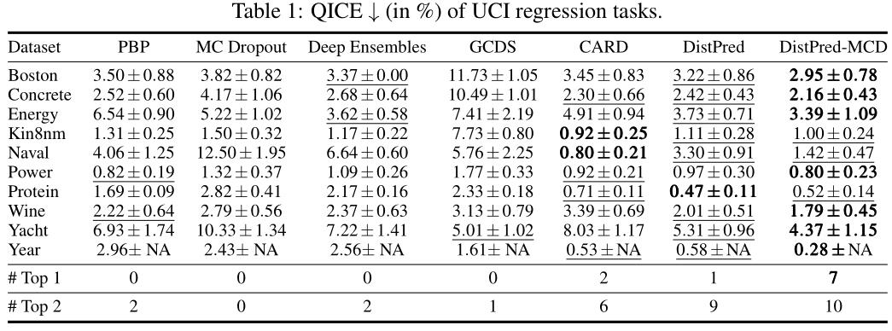
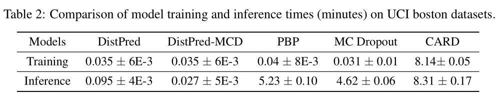
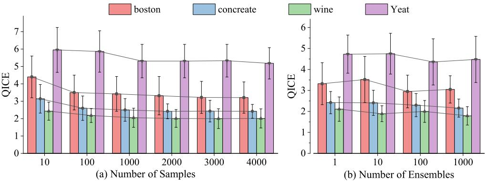
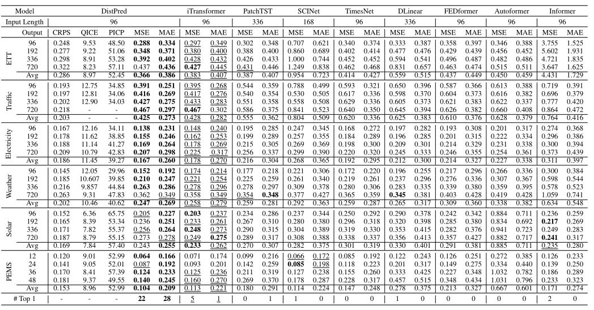

# DistPred

The repo is the official implementation for the paper: DistPred: A Distribution-Free Probabilistic Inference Method for Regression and Forecasting.

## 1. Introduction

We employ proper scoring rules to train a probabilistic inference model end-to-end, enabling the model to infer numerous samples in a singular forward pass to estimate the latent distribution of the response variable.

<div align=center></div>

## 2. Contributions

 The **key innovations** are summarized as:
- DistPred, a novel method for regression and forecasting tasks that can estimate the distribution of the response variable in a single forward pass.

- DistPred transforms proper scoring rules into a differentiable form and uses them as a loss function to train the model end-to-end, allowing the model to sample multiple distributions efficiently in a single pass.

- DistPred overcomes the limitations of existing methods like Bayesian inference, model ensembling, or MC Dropout, which either assume a Gaussian posterior distribution or require thousands of forward passes for sample generation.

- DistPred achieves state-of-the-art performance on multiple datasets while significantly improving computational efficiency, with a 90x faster inference speed compared to existing state-of-the-art models.

- DistPred can provide K predicted values of the response variable in a single forward pass, allowing for comprehensive statistical insights and uncertainty quantification.

- DistPred is shown to be equivalent to Bayesian inference in distribution inference, addressing the challenge of capturing distribution information in regression and forecasting tasks efficiently and accurately.

<div align=center></div>

## 3. Training and Testing on Toy Example or UCI Regression Dataset

### 1) UCI Regression Dataset 
The datasets can be obtained from [Google Drive](https://drive.google.com/drive/u/0/folders/16L5Dy9qw3StCY4AvtP98KA5xDZrtcHV3).

### 2) Clone the code repository
```git
git clone git@github.com:Anoise/DistPred.git
```

### 3) Training
Go to the directory "DistPred-UCI or DistPred-MCD-UCI", we'll find that the bash scripts are all in the 'training_scripts' folder, then run the bash script like this:
```shell
bash training_scripts/run_uci_boston.sh
bash training_scripts/run_uci_concrete.sh
bash training_scripts/run_uci_energy.sh
bash training_scripts/run_uci_kin8nm.sh
bash training_scripts/run_uci_power.sh
...
```


## 4. Training and Testing on Time Series Forecasting Dataset

### 1) Dataset 
The datasets can be obtained from [Google Drive](https://drive.google.com/file/d/1l51QsKvQPcqILT3DwfjCgx8Dsg2rpjot/view?usp=drive_link) or [Tsinghua Cloud](https://cloud.tsinghua.edu.cn/f/2ea5ca3d621e4e5ba36a/).

### 2) Clone the code repository
```git
git clone git@github.com:Anoise/DistPred.git
```

### 3) Training on Time Series Dataset
Go to the directory "DistPred-Forecast", we'll find that the bash scripts are all in the 'scripts' folder, then run the bash script like this:

```shell
bash scripts/Electricity/Minusformer-96M.sh
```

Note that:
- Model was trained with Python 3.7 with CUDA 11.2.
- Model should work as expected with pytorch >= 1.12 support was recently included.


## 4. Performace on Toy Example

The generated samples seamlessly integrate with the authentic test instances, indicating the potential of DistPred to reconstruct the inherent data generation process.


<div align=center></div>


## 5. Performace on UCI Regression Dataset


DistPred achieves the consistent SOTA performance across all datasets and prediction length configurations.

<div align=center></div>

## 6. Training and Inference Speed

It is evident that DistPred is approximately **230** times faster in training and about **90** times faster in inference compared to the state-of-the-art model.

<div align=center></div>


## 7. Training and Inference Speed

As shown in the following figure, with an increase in the number of output samples and ensembles, the model’s performance shows a gradual improvement, eventually reaching a point of saturation.

<div align=center></div>


## 8. Performace on Time Series Forcasting


DistPred achieves the consistent SOTA performance across all datasets and prediction length configurations.

<div align=center></div>


## 8. Citations


Daojun Liang, Haixia Zhang, Dongfeng Yuan, DistPred: A Distribution-Free Probabilistic Inference Method for Regression and Forecasting. arXiv preprint arXiv:2406.11397 (2024).

```
@article{liang2024distpred,
  title={DistPred: A Distribution-Free Probabilistic Inference Method for Regression and Forecasting},
  author={Liang, Daojun and Zhang, Haixia and Yuan, Dongfeng},
  journal={ACM SigKDD 2025},
  year={2025}
}
```


